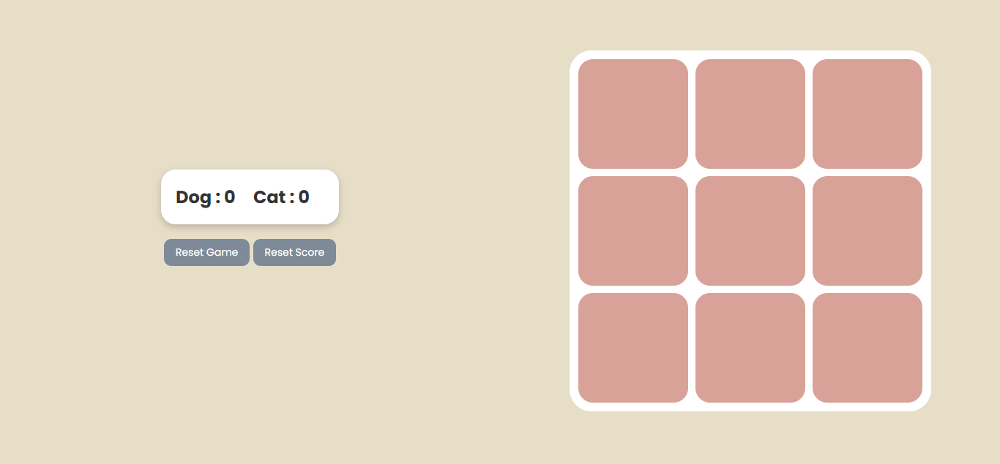

# 🐕 vs 🐈‍⬛ Tic Tac Toe  

A fun twist on the classic Tic Tac Toe game!  
Instead of boring **X** and **O**, this game uses **Dog vs Cat** icons to battle it out.  
Built with **HTML, CSS, and JavaScript** – simple yet engaging!  

---

## Features  
-  **2 Player Mode** – First click decides Player 1, second becomes Player 2.  
- 🐕 vs 🐈‍⬛ – Unique theme with emojis instead of X and O.  
-  **Score Tracker** – Keeps track of wins for each player.  
-  **Reset Options** – Reset only the board or reset both board & scores.  
-  **Game Over Lock** – Prevents further moves once someone wins or it’s a draw.  
-  Random starter (either 🐕 or 🐈‍⬛ goes first).  

---

## Screenshots  

 

---

## Tech Stack  
- **HTML5**  
- **CSS3**  
- **JavaScript (Vanilla)**  

---

## Future Improvements  
-  Add **Play vs Computer** mode (Easy & Hard AI).  
-  Add more themes (🔥 vs ❄️, 🍕 vs 🍔, etc.).  
-  Highlight winning combination with animations.
